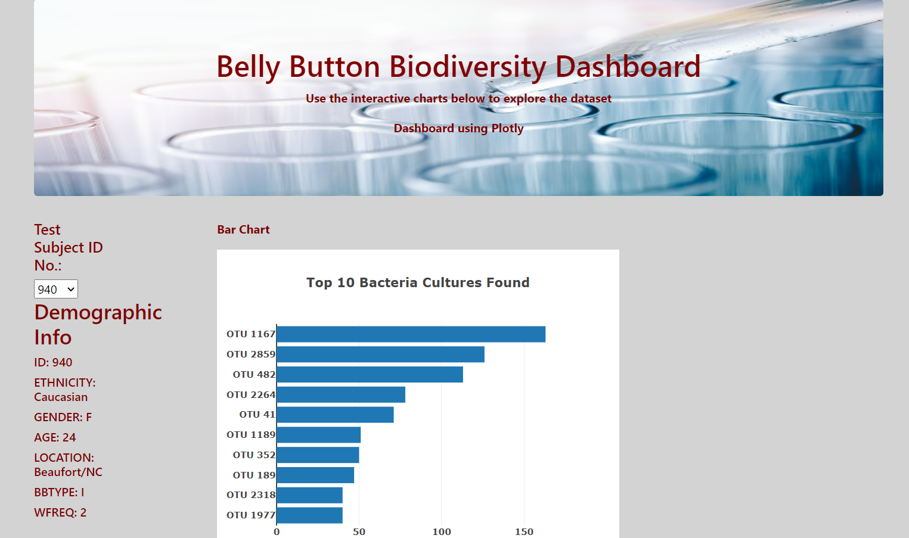

# Belly Button Biodiversity Dashboard 
  ## Project Information 
      Roza's requirement was to complete panel for demographic information and needed to visualize the bacterial data for each volunteer.  

  ## Project Details:
    ### Deliverable 1: Create a Horizontal Bar Chart
    
  

  

    ### Deliverable 2: Create a Bubble Chart

   

   

    ### Deliverable 3: Create a Gauge Chart

   

   

    ### Deliverable 4: Customize the Dashboard
    
    Add an image to the jumbotron.

   

    Use a custom font with contrast for the colors.

   
   
   Add background color or a variety of compatible colors to the webpage.
   Change the layout of the page.

   

   Add more information about the project as a paragraph on the page.

   
   
   Make the webpage mobile-responsive.

   

   Make the webpage mobile-responsive.
   
   

    
    
     
    

